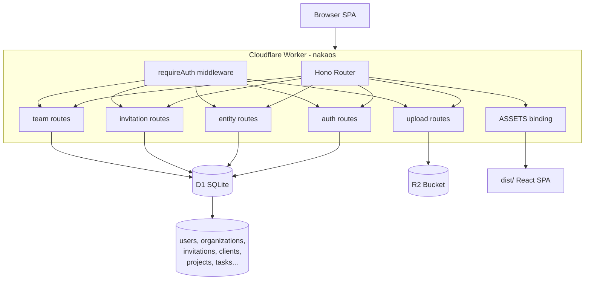
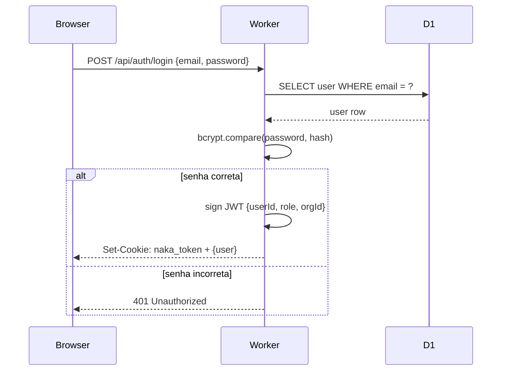
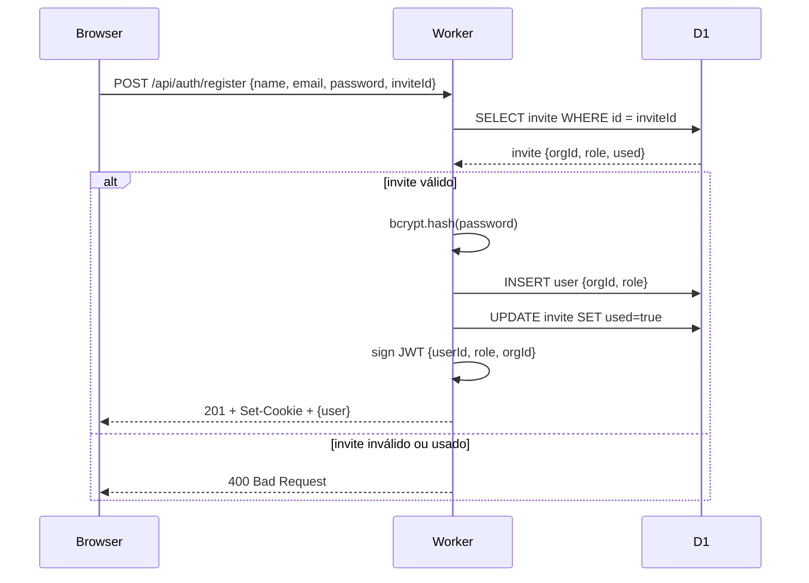
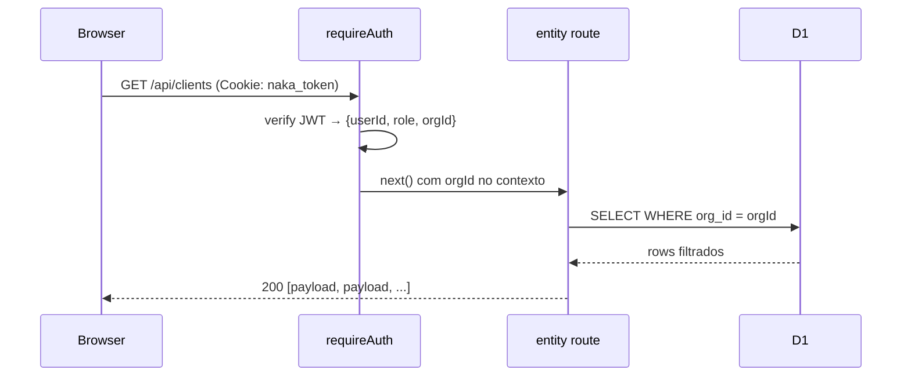
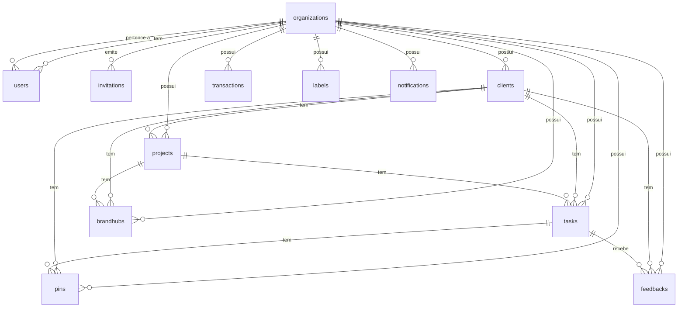
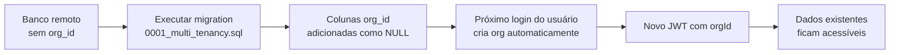

# Design Document — Naka OS

## Overview

Naka OS é uma plataforma SaaS de gestão para estúdios criativos que consolida clientes, projetos, tarefas, finanças e identidade de marca em uma única aplicação. O sistema é uma SPA React servida por um Cloudflare Worker monolítico que também expõe a API REST e armazena arquivos no R2.

**Usuários**: membros de equipe (admin, sócio, líder, seeder) e clientes externos, cada grupo com interface e permissões distintas. **Impacto**: o multi-tenancy via `org_id` garante que cada organização opera em um silo de dados completo, com isolamento aplicado no servidor em toda query.

### Goals

- Isolamento total de dados por organização em instância D1 compartilhada
- Autenticação stateless com JWT contendo `orgId` para zero lookups extras por request
- CRUD genérico de entidades via rota única filtrada por `org_id`
- Portal read-only para clientes externos sem exposição de dados internos
- Suporte a Google OAuth e email/senha no mesmo sistema

### Non-Goals

- Billing e planos de assinatura (próxima fase — Stripe)
- Email transacional (próxima fase — Resend)
- Múltiplas organizações por usuário
- Real-time / WebSockets
- Mobile nativo

---

## Architecture

### Existing Architecture Analysis

O sistema já está implementado. Este documento formaliza as decisões arquiteturais existentes para servir de base ao roadmap SaaS.

- **Padrão monolito Worker**: um único binário serve SPA, API e uploads — sem infra separada
- **Generic entity pattern**: tabelas com `{ id, org_id, payload JSON }` — schema de negócio evolui sem migrations
- **JWT stateless**: sem session store; `orgId` embutido no token elimina lookups extras
- **Role-based routing**: `requireAuth` injeta `userId`, `userRole`, `orgId` no contexto Hono; rotas verificam role antes de executar

### Architecture Pattern & Boundary Map



**Decisões-chave**:
- Monolito Worker: único deployment, sem CORS interno, zero custo de servidor
- `requireAuth` como middleware central: injeta `orgId` uma vez, propagado via contexto Hono para todos os handlers
- Entity route genérica: elimina rotas duplicadas para 9 coleções idênticas em comportamento

### Technology Stack

| Layer | Escolha / Versão | Papel | Notas |
|-------|-----------------|-------|-------|
| Frontend | React 19 + Vite 6 | SPA com React Router v7 | Servido via ASSETS binding do Worker |
| Estado | Zustand + persist | Store global + ações de API | Apenas `language` e `readNotificationIds` persistidos |
| Estilo | Tailwind CSS v4 | Design system via tokens | Integrado via plugin Vite |
| Backend | Hono 4 | Roteamento e middleware no Worker | Framework mais leve para CF Workers |
| ORM | Drizzle ORM | Queries tipadas para D1 | Sem geração de migrations — SQL manual |
| Runtime | Cloudflare Workers | Edge compute stateless | V8 isolates, ~0ms cold start |
| Banco | Cloudflare D1 | SQLite gerenciado | Replicação eventual global |
| Storage | Cloudflare R2 | Uploads de arquivo | S3-compatible, sem custo de egress |
| Auth | JWT HS256 + Google OAuth | Sessão stateless | Cookie httpOnly, SameSite=None para cross-domain |
| i18n | i18next | pt-BR / en-US | Troca dinâmica sem reload |
| PWA | vite-plugin-pwa | Cache offline + instalável | Service Worker exclui `/api/*` do cache |

---

## System Flows

### 1. Fluxo de Autenticação (Email/Senha)



### 2. Fluxo de Registro com Convite



### 3. Fluxo CRUD de Entidade com Isolamento por Org



---

## Requirements Traceability

| Requisito | Resumo | Componentes | Interface | Flow |
|-----------|--------|-------------|-----------|------|
| 1.1–1.7 | Autenticação email + Google | `AuthRoute`, `requireAuth`, `setToken` | `POST /api/auth/login`, `GET /api/auth/google` | Flow 1 |
| 2.1–2.8 | Cadastro + convites | `AuthRoute`, `InvitationRoute` | `POST /api/auth/register`, `POST /api/invitations` | Flow 2 |
| 3.1–3.5 | Multi-tenancy + isolamento | `requireAuth`, `EntityRoute`, todos os routes | Todas as rotas autenticadas | Flow 3 |
| 4.1–4.6 | RBAC | `requireAuth`, guards por role em cada route | Middleware + checagem inline | — |
| 5.1–5.9 | Gestão de clientes | `EntityRoute` (clients), `useStore.addClient` | `GET/POST/PATCH/DELETE /api/clients` | Flow 3 |
| 6.1–6.6 | Gestão de projetos | `EntityRoute` (projects) | `GET/POST/PATCH/DELETE /api/projects` | Flow 3 |
| 7.1–7.10 | Kanban + tarefas | `EntityRoute` (tasks, labels) | `GET/POST/PATCH/DELETE /api/tasks` | Flow 3 |
| 8.1–8.4 | Pins visuais | `EntityRoute` (pins) | `GET/POST/PATCH/DELETE /api/pins` | Flow 3 |
| 9.1–9.7 | Brand Hub | `EntityRoute` (brandhubs) | `GET/POST/PATCH /api/brandhubs` | Flow 3 |
| 10.1–10.5 | Finanças | `EntityRoute` (transactions) | `GET/POST/PATCH/DELETE /api/transactions` | Flow 3 |
| 11.1–11.5 | Portal do cliente | `AppRouter` (role guard), `EntityRoute` | `GET /api/tasks` (filtrado por clientId no store) | — |
| 12.1–12.3 | Gestão de equipe | `TeamRoute` | `GET /api/team`, `PATCH /api/team/:id` | — |
| 13.1–13.5 | Upload de arquivos | `UploadRoute` | `POST /api/upload` | — |
| 14.1–14.4 | Notificações | `EntityRoute` (notifications) | `GET/PATCH/DELETE /api/notifications` | — |
| 15.1–15.4 | i18n + temas + PWA | `AppProvider`, `useStore`, `vite-plugin-pwa` | localStorage + `PATCH /api/auth/me` | — |

---

## Components and Interfaces

### Resumo de Componentes

| Componente | Camada | Intent | Req | Dependências-chave | Contratos |
|------------|--------|--------|-----|-------------------|-----------|
| `requireAuth` | Backend/Middleware | Valida JWT, injeta userId/role/orgId | 1, 3, 4 | `JWT_SECRET` (P0) | Service |
| `setToken` | Backend/Auth | Assina e define cookie JWT | 1.1, 2.1 | `JWT_SECRET` (P0) | Service |
| `AuthRoute` | Backend/Routes | Login, registro, Google OAuth, /me | 1, 2 | D1, `organizations`, `users` (P0) | API |
| `EntityRoute` | Backend/Routes | CRUD genérico filtrado por orgId | 3, 5–10, 14 | D1, `requireAuth` (P0) | API |
| `InvitationRoute` | Backend/Routes | CRUD de convites por org | 2 | D1, `requireAuth` (P0) | API |
| `TeamRoute` | Backend/Routes | Membros da equipe por org | 12 | D1, `requireAuth` (P0) | API |
| `UploadRoute` | Backend/Routes | Upload para R2 com validação | 13 | R2 (P0), `requireAuth` (P0) | API |
| `AppProvider` | Frontend | Carrega dados iniciais na montagem | 5–15 | `useStore`, `api()` (P0) | State |
| `useStore` | Frontend/State | Estado global + ações de API | Todos | `api()` (P0), Zustand (P0) | State |
| `AppRouter` | Frontend | Roteamento e guards por role | 4, 11 | `UserSession.role` (P0) | — |

---

### Backend — Middleware

#### `requireAuth`

| Campo | Detalhe |
|-------|---------|
| Intent | Validar JWT, rejeitar não autenticados, injetar contexto de identidade |
| Requirements | 1.7, 3.2, 4.4 |

**Responsabilidades**
- Extrair `naka_token` do cookie da requisição
- Verificar assinatura HS256 com `JWT_SECRET`
- Injetar `userId`, `userRole`, `orgId` no contexto Hono via `c.set()`
- Retornar 401 se token ausente ou inválido

**Dependências**
- Outbound: `JWT_SECRET` env var — verificação de assinatura (P0)

**Contratos**: Service [x]

##### Service Interface
```typescript
type AuthPayload = {
  userId: string;
  role:   'admin' | 'socio' | 'lider' | 'seeder' | 'cliente';
  orgId:  string;
  exp:    number;
};

// Middleware Hono — não retorna valor; chama next() ou responde 401
const requireAuth: MiddlewareHandler<Env>;
```

**Implementation Notes**
- Tokens sem `orgId` (emitidos antes do multi-tenancy) recebem `orgId = ''`; usuário deve fazer re-login
- `SameSite=None; Secure` necessário para cookies cross-domain (Pages origin ↔ Worker origin)

---

#### `setToken`

| Campo | Detalhe |
|-------|---------|
| Intent | Assinar JWT e definir cookie httpOnly na resposta |
| Requirements | 1.1, 1.5, 2.1, 2.3 |

##### Service Interface
```typescript
async function setToken(
  c:     Context<Env>,
  userId: string,
  role:   string,
  orgId:  string
): Promise<void>;
```

- **Preconditions**: `JWT_SECRET` presente no ambiente; `orgId` não vazio
- **Postconditions**: Cookie `naka_token` definido na resposta com TTL de 30 dias
- **Invariants**: Payload sempre contém `{ userId, role, orgId, exp }`

---

### Backend — Routes

#### `AuthRoute`

| Campo | Detalhe |
|-------|---------|
| Intent | Autenticação completa: email/senha, Google OAuth, perfil e criação de org |
| Requirements | 1.1–1.7, 2.1–2.8 |

**Responsabilidades**
- Login email/senha com validação bcrypt
- Registro com criação de org (primeiro usuário) ou ingresso via convite
- Google OAuth: code exchange + userinfo + criação/vínculo de conta
- Retornar `orgId` em todas as respostas de sessão
- Auto-criar org para usuários legados sem `orgId` no login

**Dependências**
- Outbound: D1 via `getDb()` — users, organizations, invitations (P0)
- External: Google OAuth API (`accounts.google.com`, `googleapis.com`) (P1)

**Contratos**: API [x]

##### API Contract

| Method | Endpoint | Request | Response | Erros |
|--------|----------|---------|----------|-------|
| POST | `/api/auth/login` | `{ email, password }` | `{ user: UserDTO }` + cookie | 400, 401, 500 |
| POST | `/api/auth/register` | `{ name, email, password, inviteId? }` | `{ user: UserDTO }` + cookie | 400, 409, 500 |
| POST | `/api/auth/logout` | — | `{ ok: true }` | — |
| GET | `/api/auth/google` | query: `invite?` | redirect OAuth | 302 |
| GET | `/api/auth/google/callback` | query: `code`, `state` | redirect `/` ou `/portal` | 302 |
| GET | `/api/auth/me` | — (cookie) | `{ user: UserDTO }` | 401, 500 |
| PATCH | `/api/auth/me` | `{ name?, activeClientId? }` | `{ user: UserDTO }` | 401, 500 |

```typescript
type UserDTO = {
  id:             string;
  email:          string;
  name:           string;
  role:           Role;
  orgId:          string;
  activeClientId: string | null;
};

type Role = 'admin' | 'socio' | 'lider' | 'seeder' | 'cliente';
```

**Implementation Notes**
- `makeSlug(name)`: lowercase + hífens + sufixo aleatório de 6 chars para unicidade
- `createOrg()`: helper interno que insere em `organizations` e retorna o `id`
- Google callback usa `state` em base64 para carregar `inviteId` através do redirect OAuth

---

#### `EntityRoute`

| Campo | Detalhe |
|-------|---------|
| Intent | CRUD genérico para 9 coleções de entidades, todas isoladas por orgId |
| Requirements | 3.1–3.4, 5–10, 14 |

**Responsabilidades**
- Mapear `:collection` para tabela Drizzle via `TABLES` record
- Filtrar todo SELECT por `eq(table.orgId, orgId)`
- Injetar `orgId` em todo INSERT
- Verificar `orgId` antes de PATCH e DELETE (retorna 404 se não pertence à org)
- Mesclar payload no PATCH preservando campos não enviados

**Dependências**
- Inbound: `requireAuth` — fornece `orgId` (P0)
- Outbound: D1 via `getDb()` — 9 tabelas de entidade (P0)

**Contratos**: API [x]

##### API Contract

| Method | Endpoint | Request | Response | Erros |
|--------|----------|---------|----------|-------|
| GET | `/api/:collection` | — | `EntityPayload[]` | 404, 500 |
| POST | `/api/:collection` | `EntityPayload` | `EntityPayload` | 404, 500 |
| PATCH | `/api/:collection/:id` | `Partial<EntityPayload>` | `EntityPayload` (merged) | 404, 500 |
| DELETE | `/api/:collection/:id` | — | `{ ok: true }` | 404, 500 |

```typescript
// Coleções válidas
type Collection =
  | 'clients' | 'projects' | 'tasks' | 'transactions'
  | 'brandhubs' | 'pins' | 'labels' | 'notifications' | 'feedbacks';

// Estrutura no D1 (nunca exposta ao cliente)
type EntityRow = {
  id:      string;
  orgId:   string;
  payload: Record<string, unknown>;
};

// O cliente envia e recebe apenas o payload (id incluído dentro)
type EntityPayload = Record<string, unknown> & { id: string };
```

**Implementation Notes**
- PATCH faz merge superficial: `{ ...existing.payload, ...body, id }` — campos aninhados devem ser enviados completos
- O `orgId` nunca é retornado ao cliente — fica apenas na camada D1

---

#### `InvitationRoute`

| Campo | Detalhe |
|-------|---------|
| Intent | Gerenciar convites de ingresso à organização |
| Requirements | 2.2–2.8 |

##### API Contract

| Method | Endpoint | Auth | Request | Response | Erros |
|--------|----------|------|---------|----------|-------|
| GET | `/api/invitations/check/:id` | Pública | — | `{ id, role, valid }` | 404, 410 |
| GET | `/api/invitations` | admin | — | `Invitation[]` | 403, 500 |
| POST | `/api/invitations` | admin | `{ role }` | `Invitation` | 400, 403, 500 |
| DELETE | `/api/invitations/:id` | admin | — | `{ ok: true }` | 400, 403, 404 |

```typescript
type Invitation = {
  id:        string;
  orgId:     string;
  role:      'socio' | 'lider' | 'seeder' | 'cliente';
  used:      boolean;
  usedBy:    string | null;
  usedAt:    string | null;
  createdBy: string;
  createdAt: string;
};
```

**Implementation Notes**
- `GET /check/:id` é pública (sem `requireAuth`) para permitir validação antes do cadastro
- Listagem e criação filtradas por `orgId` do admin logado
- Convite não pode ser cancelado após utilização (retorna 400)

---

#### `TeamRoute`

| Campo | Detalhe |
|-------|---------|
| Intent | Listar e atualizar hierarquia de membros da organização |
| Requirements | 12.1–12.3 |

##### API Contract

| Method | Endpoint | Roles | Request | Response | Erros |
|--------|----------|-------|---------|----------|-------|
| GET | `/api/team` | admin, socio, lider | — | `TeamMember[]` | 403, 500 |
| PATCH | `/api/team/:id` | admin, socio, lider | `{ leaderId: string \| null }` | `{ ok: true }` | 403, 500 |

```typescript
type TeamMember = {
  id:        string;
  name:      string;
  email:     string;
  role:      'admin' | 'socio' | 'lider' | 'seeder';
  leaderId:  string | null;
  createdAt: string | null;
};
```

**Implementation Notes**
- Exclui usuários com role `cliente` da listagem
- PATCH filtra por `orgId` para impedir atualização de membros de outras orgs

---

#### `UploadRoute`

| Campo | Detalhe |
|-------|---------|
| Intent | Upload seguro de arquivos para R2 com validação de tipo e tamanho |
| Requirements | 13.1–13.5 |

##### API Contract

| Method | Endpoint | Request | Response | Erros |
|--------|----------|---------|----------|-------|
| POST | `/api/upload` | `FormData` (field: `file`) | `{ url: string }` | 400, 401, 500 |

```typescript
// Tipos MIME aceitos
type AllowedMime =
  | 'image/jpeg' | 'image/png' | 'image/gif'
  | 'image/webp' | 'image/svg+xml' | 'application/pdf';

// Resposta
type UploadResponse = {
  url: string; // ex: "/uploads/uuid.png"
};
```

**Implementation Notes**
- Limite: 20MB por arquivo
- Chave R2: `${uuid}.${ext}` — sem estrutura de diretório
- URL retornada é relativa; o Worker serve `GET /uploads/:key` diretamente do R2

---

### Frontend — State

#### `useStore` (Zustand)

| Campo | Detalhe |
|-------|---------|
| Intent | Store global único: estado de todas as entidades + ações de API + sessão |
| Requirements | Todos (5–15) |

**Responsabilidades**
- Armazenar estado local de todas as coleções (clients, projects, tasks, etc.)
- Expor ações que fazem `api()` call e atualizam estado local (optimistic update)
- Gerenciar sessão do usuário (`UserSession`) e preferências (idioma)
- Suportar `MOCK` mode para desenvolvimento offline

**Contratos**: State [x]

##### State Interface
```typescript
interface UserSession {
  role:           Role;
  name:           string;
  email?:         string;
  activeClientId?: string;
  orgId?:         string;
}

// Padrão de action (optimistic update)
interface EntityAction<T> {
  add(item: Omit<T, 'id'>): Promise<void>;
  update(id: string, patch: Partial<T>): Promise<void>;
  delete(id: string): Promise<void>;
}

// Helper interno de fetch
async function api(
  method: 'GET' | 'POST' | 'PATCH' | 'DELETE',
  path:   string,
  body?:  unknown
): Promise<unknown>;
```

**Implementation Notes**
- `persist` middleware do Zustand persiste apenas `language` e `readNotificationIds` no localStorage — nunca dados de entidade
- Mock mode: `VITE_MOCK_MODE=true` faz todas as ações retornarem sem chamada de API
- BrandHub usa upsert via try PATCH → catch → POST para evitar endpoint dedicado

---

#### `AppProvider`

| Campo | Detalhe |
|-------|---------|
| Intent | Carregar todos os dados iniciais após autenticação e popular o store |
| Requirements | 5–15 |

**Responsabilidades**
- Chamar `GET /api/auth/me` para restaurar sessão
- Fazer fetch paralelo de todas as coleções (`clients`, `projects`, `tasks`, etc.)
- Redirecionar para `/login` se sessão inválida
- Redirecionar para `/portal` se role === `'cliente'`

**Implementation Notes**
- Fetch paralelo das coleções com `Promise.all` para minimizar tempo de carregamento inicial
- Erro de fetch em qualquer coleção não bloqueia o restante — cada um é independente

---

### Frontend — Routing

#### `AppRouter`

| Campo | Detalhe |
|-------|---------|
| Intent | Roteamento da SPA com guards baseados em role |
| Requirements | 4.3, 4.4, 11.1, 11.4 |

```typescript
// Guard de role
type AllowedRoles = Role[];

// Rotas principais
// /             → sistema interno (admin, socio, lider, seeder)
// /portal       → portal do cliente (cliente)
// /login        → pública
// /register     → pública (requer inviteId válido para roles não-admin)
```

**Implementation Notes**
- Role `cliente` é redirecionado de `/` para `/portal` automaticamente
- Roles internas são redirecionadas de `/portal` para `/`

---

## Data Models

### Domain Model



**Aggregate Roots**: `Organization` (raiz de isolamento), `User`, `Client`, `Project`, `Task`

**Invariantes**:
- Toda entidade pertence a exatamente uma `Organization`
- Um `User` pertence a exatamente uma `Organization`
- Um convite pertence a uma `Organization` e pode ser usado apenas uma vez

### Physical Data Model

#### Tabelas estruturadas (colunas explícitas)

```sql
-- organizations
CREATE TABLE organizations (
  id         TEXT PRIMARY KEY,
  name       TEXT NOT NULL,
  slug       TEXT NOT NULL UNIQUE,
  created_by TEXT NOT NULL,
  created_at TEXT NOT NULL
);

-- users
CREATE TABLE users (
  id               TEXT PRIMARY KEY,
  email            TEXT NOT NULL UNIQUE,
  name             TEXT NOT NULL,
  password_hash    TEXT,
  google_id        TEXT,
  role             TEXT NOT NULL DEFAULT 'cliente',
  org_id           TEXT,                          -- FK → organizations.id
  active_client_id TEXT,
  leader_id        TEXT,                          -- FK → users.id
  created_at       TEXT
);

-- invitations
CREATE TABLE invitations (
  id         TEXT PRIMARY KEY,
  org_id     TEXT,                               -- FK → organizations.id
  role       TEXT NOT NULL,
  used       INTEGER NOT NULL DEFAULT 0,
  used_by    TEXT,
  used_at    TEXT,
  created_by TEXT NOT NULL,                      -- FK → users.id
  created_at TEXT
);
```

#### Tabelas de entidade (payload JSON)

```sql
-- Padrão idêntico para: clients, projects, tasks, transactions,
--   brandhubs, pins, labels, notifications, feedbacks
CREATE TABLE <entity> (
  id      TEXT PRIMARY KEY,
  org_id  TEXT NOT NULL,    -- discriminador de tenant
  payload TEXT NOT NULL     -- JSON serializado via Drizzle mode:'json'
);
```

**Decisão**: `org_id` como coluna explícita (não dentro do JSON) permite `WHERE org_id = ?` com índice potencial, sem `json_extract()`.

### Data Contracts & Integration

#### Fluxo de payload entre cliente e servidor

```
Cliente (frontend)          D1 (storage)
─────────────────           ─────────────
POST /api/clients           INSERT clients
{ id, name, ... }    →      (id, org_id, payload)
                            payload = { id, name, ... }

GET /api/clients            SELECT * WHERE org_id = ?
← [{ id, name, ... }]  ←   rows.map(r => r.payload)
```

O cliente nunca vê `org_id` — ele é injetado no servidor e filtrado na resposta.

---

## Error Handling

### Error Strategy

Erros são retornados sempre como `{ error: string }` com código HTTP semântico. O cliente exibe toast de erro via `sonner`. O servidor loga com `console.error` (visível no Cloudflare Dashboard).

### Error Categories

| Categoria | Código | Exemplos | Resposta |
|-----------|--------|---------|---------|
| Auth | 401 | Token inválido, sem cookie | `{ error: 'Unauthorized' }` |
| Permissão | 403 | Role insuficiente | `{ error: 'Forbidden' }` |
| Não encontrado | 404 | Coleção inexistente, entidade de outra org | `{ error: 'Not found' }` |
| Conflito | 409 | Email já cadastrado | `{ error: 'Email já cadastrado' }` |
| Gone | 410 | Convite já utilizado | `{ error: 'Convite já utilizado' }` |
| Servidor | 500 | Falha D1, falha R2 | `{ error: 'Erro interno' }` |

### Monitoring

- Erros de Worker logados automaticamente no Cloudflare Dashboard (Workers > Logs)
- `app.onError` global em `server/index.ts` captura exceções não tratadas
- Frontend: erros de `api()` lançam exceção; o componente responsável exibe toast

---

## Testing Strategy

### Unit Tests

- `requireAuth`: token válido injeta contexto; token inválido retorna 401; token sem `orgId` define `orgId = ''`
- `setToken`: JWT gerado contém `{ userId, role, orgId, exp }`; cookie tem atributos corretos
- `makeSlug`: nomes com caracteres especiais geram slug válido; slugs são únicos por sufixo aleatório
- `EntityRoute GET`: retorna apenas registros da org do usuário; coleção inválida retorna 404

### Integration Tests

- Registro → login → GET /api/clients: usuário novo vê apenas seus dados
- Dois usuários em orgs distintas: cada um vê apenas seus próprios registros
- Convite: admin cria → novo usuário se cadastra com convite → pertence à mesma org
- Upload: arquivo válido salvo no R2; arquivo > 20MB ou tipo inválido rejeitado

### E2E / UI Tests

- Login com email/senha → redirect para dashboard → dados carregados
- Usuário `cliente` → redirect para `/portal` → não acessa rotas internas
- Criar cliente → aparece na listagem → editar → deletar
- Criar tarefa no kanban → mover de status → feedback do cliente visível

### Security Tests

- Request com `orgId` manipulado no payload não contamina dados de outra org
- Acesso a `/api/clients` sem cookie retorna 401
- Role `seeder` não consegue acessar `POST /api/invitations`

---

## Security Considerations

- **JWT httpOnly**: token inacessível por JavaScript no browser — protege contra XSS
- **SameSite=None; Secure**: necessário para cross-domain; requer HTTPS em produção
- **Isolamento por orgId no servidor**: o cliente nunca envia `orgId` — sempre vem do JWT
- **bcrypt rounds=12**: custo computacional adequado para senhas; resistente a brute force
- **Tipos de arquivo validados**: upload rejeita MIME não permitido antes de escrever no R2
- **Convites de uso único**: `used=true` ao registrar; verificação antes de aceitar

---

## Migration Strategy



**Comando de produção**:
```bash
npx wrangler d1 execute nakaosdb --remote --file=migrations/0001_multi_tenancy.sql
```

**Rollback**: não há rollback automático para `ALTER TABLE ADD COLUMN` em SQLite — fazer backup via D1 export antes de aplicar.
