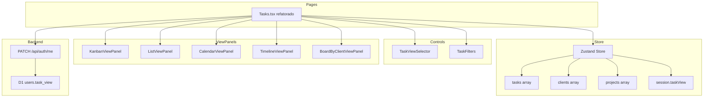
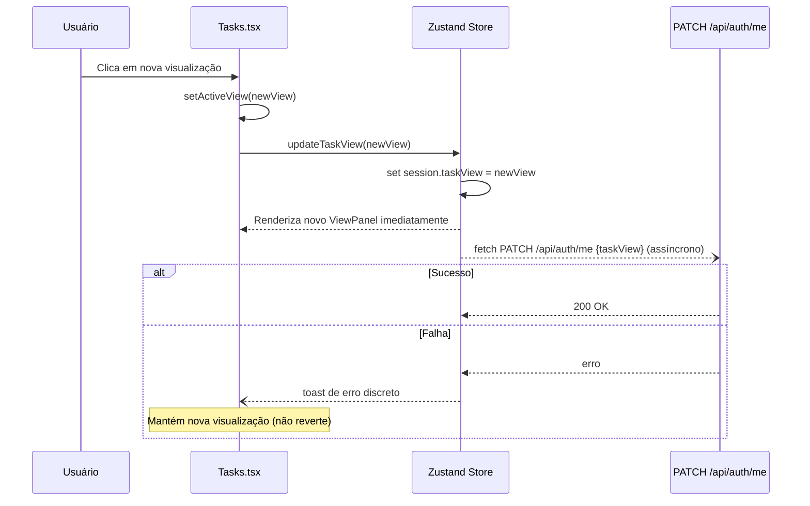
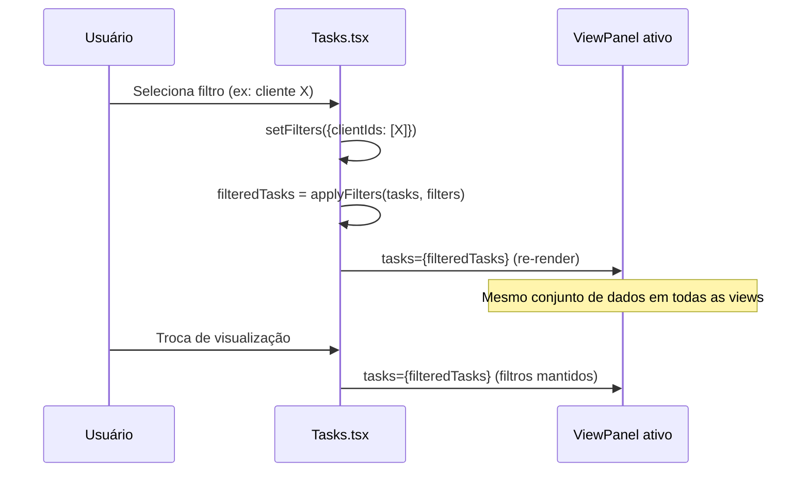
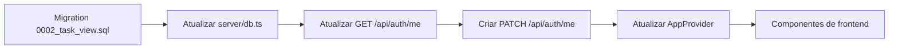

# Design Técnico — Task Views

## Overview

Esta feature transforma a página de tarefas do Naka OS de um dashboard estático de cards por cliente em um hub de gerenciamento multi-visualização. Usuários podem alternar entre cinco modos (Kanban, Lista, Calendário, Timeline e Board por Cliente), com filtros e agrupamentos configuráveis aplicados de forma consistente em todas as visualizações.

**Purpose**: Entrega flexibilidade de gerenciamento de tarefas para equipes de agência com diferentes estilos de trabalho, sem duplicação de dados nem chamadas adicionais ao backend para filtros.

**Users**: Membros internos da equipe (`admin`, `socio`, `lider`, `seeder`) que gerenciam tarefas. Clientes não têm acesso a esta área.

**Impact**: Refatora `src/pages/Tasks.tsx` de dashboard de cliente-cards para contêiner multi-view; adiciona coluna `task_view` à tabela `users`; cria endpoint `PATCH /api/auth/me`; adiciona campo `startDate` à interface `Task`.

### Goals

- Cinco visualizações de tarefas intercambiáveis sem recarregar a página
- Preferência de visualização persistida por usuário no backend
- Filtros (cliente/projeto/responsável) consistentes entre todas as visualizações na mesma sessão
- Agrupamento configurável na visualização Lista
- Zero novas dependências de bibliotecas externas

### Non-Goals

- Drag-and-drop entre colunas no Board por Cliente (somente leitura com click-to-detail)
- Edição inline de campos diretamente nas visualizações (exceto mudança de status no Kanban via DnD)
- Persistência de filtros no backend (filtros são session-scoped)
- Exportação de visualizações para PDF nesta fase
- Suporte a visualizações para o portal do cliente

---

## Architecture

### Existing Architecture Analysis

**`src/pages/Tasks.tsx` atual**: Exibe cards de cliente com contadores de tarefas, sem nenhuma visualização de tarefas em si. Será completamente refatorada — a lógica de cards migra para `BoardByClientViewPanel`.

**`src/pages/KanbanBoard.tsx`**: Kanban existente por-cliente (acessado via `/clients/:id/tasks`). Mantido intacto — o novo `KanbanViewPanel` é um Kanban all-tasks independente.

**Store Zustand (`src/store/index.ts`)**: Fonte única de verdade. Dados de tasks, clients, projects e teamUsers já são carregados na inicialização. Filtros operam sobre esses arrays em memória.

**Padrão DnD existente**: HTML5 nativo (`draggable`, `onDragStart`, `onDrop`) sem bibliotecas externas. Mantido no novo Kanban.

### Architecture Pattern & Boundary Map



**Key decisions**:
- `Tasks.tsx` é o único orquestrador — mantém estado de `activeView`, `filters` e `groupBy` em `useState` local
- View panels são componentes "burros" — recebem tasks filtradas por props, sem acesso direto ao store
- Persistência de `taskView` é fire-and-forget com fallback silencioso (Requirement 2.3)

### Technology Stack

| Layer | Escolha | Papel nesta feature | Notas |
|-------|---------|---------------------|-------|
| Frontend | React 19 + TypeScript | Componentes de visualização | — |
| UI Components | shadcn/ui + shadcnblocks.com | Primitivos e blocos prontos | `npx shadcn@latest add [component]` |
| State | Zustand 5 | Fonte de dados (tasks, clients, session) | Sem middleware novo |
| DnD (Kanban) | HTML5 nativo | Drag entre colunas de status | Padrão do KanbanBoard existente |
| Styling | Tailwind CSS v4 | Layout das views | CSS positioning para Timeline |
| Backend | Hono 4 em Cloudflare Worker | PATCH /api/auth/me | Novo handler no router existente |
| DB | D1 (SQLite) + Drizzle ORM | Coluna task_view em users | Migration manual 0002 |
| Icons | Lucide React | Ícones do seletor de views | Já instalado |

**Componentes shadcn/ui a instalar por visualização:**

| View | Componentes shadcn | Comando |
|------|--------------------|---------|
| Todas | `Button`, `Badge`, `Separator`, `Tooltip` | `npx shadcn@latest add button badge separator tooltip` |
| TaskViewSelector | `ToggleGroup`, `Toggle` | `npx shadcn@latest add toggle-group` |
| TaskFilters | `Popover`, `Command`, `Checkbox` | `npx shadcn@latest add popover command checkbox` |
| ListView | `Table` (thead/tbody/tr/td) | `npx shadcn@latest add table` |
| CalendarView | `Calendar` | `npx shadcn@latest add calendar` |
| KanbanView / BoardByClient | `Card`, `ScrollArea` | `npx shadcn@latest add card scroll-area` |
| Timeline | `ScrollArea` | (acima) |
| Task detail (click) | `Sheet` (drawer lateral) | `npx shadcn@latest add sheet` |

---

## System Flows

### Fluxo de Troca de Visualização com Persistência



### Fluxo de Aplicação de Filtros



---

## Requirements Traceability

| Requisito | Resumo | Componente(s) | Interface | Fluxo |
|-----------|--------|---------------|-----------|-------|
| 1.1 | Seletor com 5 opções no header | `TaskViewSelector` | `TaskViewSelectorProps` | — |
| 1.2 | Troca imediata sem reload | `Tasks.tsx` state | `activeView` state | Fluxo de troca |
| 1.3 | Destaque visual da view ativa | `TaskViewSelector` | `activeView` prop | — |
| 1.4 | Kanban como padrão sem preferência | `Tasks.tsx` | `session.taskView ?? 'kanban'` | — |
| 2.1 | PATCH /api/auth/me ao trocar | `Tasks.tsx` + Store | `updateTaskView` action | Fluxo de persistência |
| 2.2 | Restaurar preferência na próxima sessão | `AppProvider.tsx` | `me.taskView` no init | — |
| 2.3 | Falha silenciosa sem reverter | `Tasks.tsx` | try/catch + toast | Fluxo de troca |
| 2.4 | Valores válidos de taskView | Store + API | `TaskViewType` | — |
| 3.1 | Colunas por status no Kanban | `KanbanViewPanel` | `KanbanColumnProps` | — |
| 3.2 | DnD atualiza status imediatamente | `KanbanViewPanel` | `updateTaskStatus` action | — |
| 3.3 | Card com campos visíveis | `KanbanTaskCard` | `KanbanTaskCardProps` | — |
| 3.4 | Contador por coluna no Kanban | `KanbanViewPanel` | coluna header | — |
| 4.1 | Tabela com 8 colunas | `ListViewPanel` | `ListViewPanelProps` | — |
| 4.2–4.3 | Ordenação clicável com indicador | `ListViewPanel` | `SortState` | — |
| 4.4 | Click abre painel de detalhes | `ListViewPanel` | `onTaskClick` callback | — |
| 5.1 | Calendário mensal com navegação | `CalendarViewPanel` | `CalendarViewPanelProps` | — |
| 5.2 | Tarefa na célula da dueDate | `CalendarViewPanel` | posicionamento por data | — |
| 5.3 | Tarefas sem data: aviso + omissão | `CalendarViewPanel` | `undatedCount` | — |
| 5.4 | Empilhamento e indicador de overflow | `CalendarViewPanel` | max-items per cell | — |
| 5.5 | Click abre detalhes | `CalendarViewPanel` | `onTaskClick` | — |
| 6.1 | Eixo temporal com navegação | `TimelineViewPanel` | `viewStart`/`viewEnd` state | — |
| 6.2 | Barra entre startDate e dueDate | `TimelineViewPanel` | CSS positioning | — |
| 6.3 | Sem startDate: usa dueDate, largura mínima 1d | `TimelineViewPanel` | normalização local | — |
| 6.4 | Sem datas: omite e avisa | `TimelineViewPanel` | `undatedCount` | — |
| 6.5 | Cor da barra por prioridade | `TimelineViewPanel` | `priorityBarColor` map | — |
| 6.6 | Tooltip no hover | `TimelineViewPanel` | `TaskTooltip` | — |
| 6.7 | Click abre detalhes | `TimelineViewPanel` | `onTaskClick` | — |
| 7.1 | Coluna por cliente | `BoardByClientViewPanel` | `ClientColumn` | — |
| 7.2 | Avatar/nome no header da coluna | `BoardByClientViewPanel` | `client.logo`/`client.name` | — |
| 7.3 | Contador por coluna de cliente | `BoardByClientViewPanel` | coluna header | — |
| 7.4 | Coluna "Sem Cliente" | `BoardByClientViewPanel` | `unassignedColumn` | — |
| 7.5 | Click abre detalhes | `BoardByClientViewPanel` | `onTaskClick` | — |
| 8.1 | 3 filtros com multi-select | `TaskFilters` | `TaskFiltersProps` | — |
| 8.2 | Atualização imediata ao filtrar | `Tasks.tsx` | `applyFilters()` local | Fluxo de filtros |
| 8.3 | Projeto condicionado ao cliente | `TaskFilters` | `availableProjects` derivado | — |
| 8.4 | Badge de filtros ativos | `TaskFilters` | `activeFilterCount` | — |
| 8.5 | Limpar filtros | `TaskFilters` | `onClear` callback | — |
| 8.6 | Filtros mantidos ao trocar view | `Tasks.tsx` | `filters` em useState | — |
| 9.1 | Seletor de agrupamento na Lista | `ListViewPanel` | `GroupBySelector` | — |
| 9.2 | Seções colapsáveis por grupo | `ListViewPanel` | `GroupedSection` | — |
| 9.3 | Nome + contador no header de grupo | `ListViewPanel` | `GroupedSection` header | — |
| 9.4 | Colapsar/expandir ao clicar | `ListViewPanel` | `collapsedGroups` state | — |
| 9.5 | Sem agrupamento: lista plana ordenável | `ListViewPanel` | `groupBy === 'none'` | — |
| 10.1 | Fonte única (store global) | `Tasks.tsx` | `useStore(s => s.tasks)` | — |
| 10.2 | Edição reflete em todas as views | Store actions | `updateTask` → re-render | — |
| 10.3 | Mesmo filtro em todas as views | `Tasks.tsx` | `filteredTasks` derivado | — |
| 10.4 | Indicador de carregamento | `Tasks.tsx` | `isAuthReady` do AppProvider | — |

---

## Components and Interfaces

### Resumo de Componentes

| Componente | Camada | Intenção | Requisitos | Dependências-chave | Contratos |
|------------|--------|----------|------------|-------------------|-----------|
| `Tasks.tsx` | Page / Orquestrador | Hub multi-view + estado de filtros | 1.2, 1.4, 2.1, 8.6, 10.1–10.4 | Store, todos os painéis | State |
| `TaskViewSelector` | UI Control | Seletor visual de visualização ativa | 1.1, 1.2, 1.3 | — | State |
| `TaskFilters` | UI Control | Filtros multi-select por cliente/projeto/responsável | 8.1–8.6 | clients, projects, teamUsers | State |
| `KanbanViewPanel` | View Panel | Kanban all-tasks por status com DnD | 3.1–3.4 | HTML5 DnD, updateTaskStatus | State |
| `ListViewPanel` | View Panel | Tabela ordenável com agrupamento colapsável | 4.1–4.4, 9.1–9.5 | — | State |
| `CalendarViewPanel` | View Panel | Calendário mensal com navegação | 5.1–5.5 | — | State |
| `TimelineViewPanel` | View Panel | Barras Gantt com CSS positioning | 6.1–6.7 | — | State |
| `BoardByClientViewPanel` | View Panel | Colunas por cliente (ex-Tasks.tsx) | 7.1–7.5 | clients | State |

---

### Page / Orquestrador

#### Tasks.tsx (refatorado)

| Campo | Detalhe |
|-------|---------|
| Intent | Orquestrador da área de tarefas: mantém estado de view ativa, filtros e agrupamento; deriva tasks filtradas; persiste preferência |
| Requirements | 1.2, 1.4, 2.1, 2.3, 8.6, 10.1, 10.3, 10.4 |

**Responsibilities & Constraints**
- Lê `tasks`, `clients`, `projects`, `teamUsers` e `session` do store
- Mantém `activeView`, `filters` e `groupBy` em `useState` local (session-scoped)
- Deriva `filteredTasks` com `useMemo` aplicando os filtros ativos
- Persiste `taskView` via `PATCH /api/auth/me` de forma assíncrona (fire-and-forget)
- Renderiza o painel de view correto com `filteredTasks` por props

**Dependencies**
- Inbound: `AppProvider` — garante dados carregados antes de renderizar (P0)
- Outbound: `KanbanViewPanel`, `ListViewPanel`, `CalendarViewPanel`, `TimelineViewPanel`, `BoardByClientViewPanel` — renderização das views (P0)
- Outbound: `TaskViewSelector`, `TaskFilters` — controles do header (P0)
- External: `useStore` Zustand — leitura de dados e `updateTask` (P0)
- External: `PATCH /api/auth/me` — persistência de preferência (P1)

**Contracts**: State [ ✓ ]

##### State Management

```typescript
type TaskViewType = 'kanban' | 'list' | 'calendar' | 'timeline' | 'board-by-client';

type GroupByOption = 'none' | 'client' | 'project' | 'assignee' | 'priority' | 'status';

interface TaskFiltersState {
  clientIds: string[];
  projectIds: string[];
  assigneeNames: string[];
}

// Estado local do componente Tasks.tsx
interface TasksPageState {
  activeView: TaskViewType;          // Inicializado de session.taskView ?? 'kanban'
  filters: TaskFiltersState;         // Padrão: todos os arrays vazios
  groupBy: GroupByOption;            // Relevante apenas para ListView
}

// Lógica de derivação (useMemo)
function applyFilters(tasks: Task[], filters: TaskFiltersState): Task[] {
  // Filtra por clientIds, projectIds, assigneeNames (OR dentro de cada dimensão, AND entre dimensões)
}
```

- **Persistência**: `taskView` é gravado no backend; `filters` e `groupBy` são session-scoped (sem persistência)
- **Concorrência**: fire-and-forget para `PATCH /api/auth/me`; sem race condition pois o estado local já foi atualizado antes da chamada

**Implementation Notes**
- Integração: importar `useApp()` do `AppProvider` para aguardar `isAuthReady` antes de renderizar os painéis; exibir skeleton enquanto `!isAuthReady`
- Validação: initializar `activeView` a partir de `session?.taskView ?? 'kanban'` no `useMemo` inicial
- Riscos: se `PATCH /api/auth/me` não aceitar `taskView` (endpoint não criado), a persistência silencia com toast — implementar o endpoint em conjunto

---

### UI Controls

#### TaskViewSelector

| Campo | Detalhe |
|-------|---------|
| Intent | Renderiza o seletor de 5 visualizações no header da área de tarefas |
| Requirements | 1.1, 1.2, 1.3 |

**Contracts**: State [ ✓ ]

```typescript
interface TaskViewSelectorProps {
  activeView: TaskViewType;
  onChange: (view: TaskViewType) => void;
}

// Configuração estática das 5 views
interface ViewConfig {
  id: TaskViewType;
  labelKey: string;   // chave i18n
  icon: LucideIcon;
}
```

**Implementation Notes**
- Exibir como grupo de botões com `aria-pressed` para acessibilidade
- View ativa: fundo `bg-primary/10 text-primary`, demais: `text-on-surface-variant`

---

#### TaskFilters

| Campo | Detalhe |
|-------|---------|
| Intent | Controles de filtro multi-select por Cliente, Projeto e Responsável com badge de filtros ativos |
| Requirements | 8.1–8.6 |

**Contracts**: State [ ✓ ]

```typescript
interface TaskFiltersProps {
  filters: TaskFiltersState;
  clients: Client[];
  projects: Project[];
  teamUsers: TeamUser[];
  onChange: (filters: TaskFiltersState) => void;
  onClear: () => void;
}

// availableProjects é derivado dentro do componente:
// se filters.clientIds não vazio → filtra projects.filter(p => filters.clientIds includes p.clientId)
// senão → todos os projects
```

**Implementation Notes**
- Cada filtro é um dropdown com checkboxes (não requer biblioteca externa — implementação custom com `useState`)
- `activeFilterCount` = soma de clientIds.length + projectIds.length + assigneeNames.length
- Badge numérico exibido no ícone de filtro quando `activeFilterCount > 0` (Requirement 8.4)

---

### View Panels

Todos os painéis compartilham estas props base:

```typescript
interface BaseViewPanelProps {
  tasks: Task[];           // Já filtradas pelo orquestrador
  clients: Client[];
  projects: Project[];
  teamUsers: TeamUser[];
  onTaskClick: (taskId: string) => void;   // Abre painel de detalhes (KanbanBoard)
}
```

#### KanbanViewPanel

| Campo | Detalhe |
|-------|---------|
| Intent | Kanban all-tasks com colunas por status e drag-and-drop para mudança de status |
| Requirements | 3.1, 3.2, 3.3, 3.4 |

**Contracts**: State [ ✓ ]

```typescript
interface KanbanViewPanelProps extends BaseViewPanelProps {
  onStatusChange: (taskId: string, newStatus: Task['status']) => void;
}

// Colunas fixas (Requirement 3.1)
type KanbanColumn = {
  status: Task['status'];
  label: string;
  color: string;
};

const KANBAN_COLUMNS: KanbanColumn[] = [
  { status: 'todo',        label: 'A Fazer',      color: 'text-on-surface-variant' },
  { status: 'in-progress', label: 'Em Progresso', color: 'text-primary' },
  { status: 'review',      label: 'Revisão',      color: 'text-secondary' },
  { status: 'done',        label: 'Concluído',    color: 'text-tertiary' },
];
```

**Implementation Notes**
- DnD: HTML5 nativo — `draggable={true}` no card, `onDragStart` guarda `taskId`, `onDrop` chama `onStatusChange`
- Card exibe: título, cliente, projeto, responsável(eis), prioridade (badge colorido), dueDate (Requirement 3.3)
- Contador no header da coluna via `tasks.filter(t => t.status === col.status).length` (Requirement 3.4)

---

#### ListViewPanel

| Campo | Detalhe |
|-------|---------|
| Intent | Tabela plana ordenável com opção de agrupamento colapsável por 5 critérios |
| Requirements | 4.1–4.4, 9.1–9.5 |

**Contracts**: State [ ✓ ]

```typescript
interface ListViewPanelProps extends BaseViewPanelProps {
  groupBy: GroupByOption;
  onGroupByChange: (groupBy: GroupByOption) => void;
}

interface SortState {
  column: 'title' | 'status' | 'priority' | 'client' | 'project' | 'assignee' | 'startDate' | 'dueDate';
  direction: 'asc' | 'desc';
}

interface GroupedSection {
  key: string;
  label: string;
  tasks: Task[];
  collapsed: boolean;
}
```

**Implementation Notes**
- Ordenação: estado `SortState` local, `useMemo` para ordenar
- Indicador de direção: ícone `ChevronUp`/`ChevronDown` no header da coluna ativa (Requirement 4.3)
- Agrupamento: `collapsedGroups: Set<string>` em `useState` local — toggle por key do grupo (Requirement 9.4)
- Quando `groupBy !== 'none'`: tasks são agrupadas antes de ordenar; ordenação aplica-se dentro de cada grupo
- Click em linha → `onTaskClick(task.id)` (Requirement 4.4)

---

#### CalendarViewPanel

| Campo | Detalhe |
|-------|---------|
| Intent | Calendário mensal com navegação e tarefas posicionadas pela dueDate |
| Requirements | 5.1–5.5 |

**Contracts**: State [ ✓ ]

```typescript
interface CalendarViewPanelProps extends BaseViewPanelProps {}

// Estado local do painel
interface CalendarState {
  currentMonth: Date;   // Primeiro dia do mês visível
}

interface CalendarCell {
  date: Date;
  tasks: Task[];
  isCurrentMonth: boolean;
}
```

**Implementation Notes**
- Grid 7×6 de células (Sun–Sat); dias do mês anterior/posterior renderizados com opacidade reduzida
- Tarefas sem `dueDate` omitidas; contagem exibida em aviso fixo no topo (Requirement 5.3)
- Overflow: exibir máximo 3 tarefas por célula + badge `+N mais` (Requirement 5.4)
- Navegação: botões `←` / `→` no header do calendário; estado `currentMonth` em `useState`

---

#### TimelineViewPanel

| Campo | Detalhe |
|-------|---------|
| Intent | Visualização Gantt com barras horizontais posicionadas por CSS entre startDate e dueDate |
| Requirements | 6.1–6.7 |

**Contracts**: State [ ✓ ]

```typescript
interface TimelineViewPanelProps extends BaseViewPanelProps {}

// Estado local do painel
interface TimelineState {
  viewStart: Date;   // Primeiro dia do período visível (padrão: início do mês atual)
  totalDays: number; // Padrão: 30
}

interface TimelineBarStyle {
  leftPercent: number;
  widthPercent: number;
}

// Cálculo de posição
function calcBarStyle(task: Task, viewStart: Date, totalDays: number): TimelineBarStyle | null;
```

**Implementation Notes**
- Fórmula CSS: `left = (taskStart - viewStart) / totalDays * 100%`, `width = (taskEnd - taskStart + 1) / totalDays * 100%` (mínimo 1/totalDays)
- Cores de barra por prioridade (Requirement 6.5):
  - `Urgente`/`Alta`: `bg-[#ffb4ab]` (vermelho)
  - `Média`: `bg-[#6cd3fc]` (azul)
  - `Baixa`: `bg-[#81c784]` (verde)
- Tooltip no hover com `title`, `assignees`, `startDate`, `dueDate`, `status` (Requirement 6.6) — div posicionado absolutamente
- Tarefas sem datas: omitidas; contagem em aviso no topo (Requirement 6.4)
- Navegação: anterior/próximo período de 30 dias via `setViewStart`

---

#### BoardByClientViewPanel

| Campo | Detalhe |
|-------|---------|
| Intent | Colunas por cliente (migração da lógica atual de Tasks.tsx); uma coluna "Sem Cliente" |
| Requirements | 7.1–7.5 |

**Contracts**: State [ ✓ ]

```typescript
interface BoardByClientViewPanelProps extends BaseViewPanelProps {}

interface ClientColumn {
  clientId: string | null;   // null = "Sem Cliente"
  client: Client | null;
  tasks: Task[];
}
```

**Implementation Notes**
- Derivar `ClientColumn[]` agrupando `tasks` por `clientId` (Requirement 7.1)
- Clientes sem tarefas ativas (após filtros) não geram coluna (Requirement 7.1)
- Coluna "Sem Cliente" exibida por último se existirem tarefas sem `clientId` (Requirement 7.4)
- Avatar: `client.logo` (emoji ou iniciais) (Requirement 7.2)

---

### Backend — API

#### PATCH /api/auth/me

| Campo | Detalhe |
|-------|---------|
| Intent | Persistir campos editáveis do perfil do usuário autenticado (taskView nesta fase) |
| Requirements | 2.1, 2.4 |

**Contracts**: API [ ✓ ]

##### API Contract

| Method | Endpoint | Request | Response | Errors |
|--------|----------|---------|----------|--------|
| PATCH | `/api/auth/me` | `{ taskView?: TaskViewType }` | `{ ok: true }` | 400 (valor inválido), 401 (não autenticado) |

**Preconditions**: Token JWT válido no cookie `httpOnly`; `taskView` é um dos 5 valores válidos.

**Implementation Notes**
- Extrair `userId` do middleware `requireAuth`
- Validar que `taskView` pertence ao conjunto `['kanban','list','calendar','timeline','board-by-client']` antes de gravar
- `db.update(users).set({ taskView: body.taskView }).where(eq(users.id, userId))`
- `GET /api/auth/me` também deve incluir `taskView` na resposta (atualizar handler existente)

---

## Data Models

### Domain Model

A feature não introduz novos agregados. O campo `taskView` é um atributo de preferência do agregado `User`. O campo `startDate` é um atributo opcional do agregado `Task`.

### Logical Data Model

**Alterações na entidade `User`**:
- Novo campo: `taskView: TaskViewType | null` (padrão `null`, interpretado como `'kanban'` no frontend)

**Alterações na entidade `Task`**:
- Novo campo: `startDate?: string` (ISO 8601, opcional) — apenas no JSON payload do padrão de entidade genérica

### Physical Data Model

**Migration `0002_task_view.sql`**:

```sql
ALTER TABLE users ADD COLUMN task_view TEXT;
```

- Valor `NULL` → frontend usa `'kanban'` como padrão (Requirement 1.4)
- Validação de valores no endpoint PATCH; banco não tem check constraint (Workers D1 não suporta CHECK em ALTER TABLE)

**Drizzle schema (`server/db.ts`)** — campo a adicionar:

```typescript
// Na definição da tabela users:
taskView: text('task_view'),
```

**Interface `Task` (`src/store/index.ts`)** — campo a adicionar:

```typescript
startDate?: string;   // ISO 8601, ex: "2026-04-01"
```

**Interface `UserSession` (`src/store/index.ts`)** — campo a adicionar:

```typescript
taskView?: TaskViewType;
```

### Data Contracts & Integration

**`GET /api/auth/me` — resposta atualizada**:

```typescript
{
  user: {
    id: string;
    email: string;
    name: string;
    role: UserRole;
    orgId: string;
    activeClientId?: string;
    taskView?: TaskViewType;   // NOVO
  }
}
```

**`PATCH /api/auth/me` — request**:

```typescript
{
  taskView?: TaskViewType;   // um dos 5 valores válidos
}
```

---

## Error Handling

### Error Strategy

Persistência de visualização: fire-and-forget com notificação discreta. Filtros e ordenação: operações síncronas client-side sem falha possível. DnD: se `updateTaskStatus` falhar, exibir toast de erro via `sonner`.

### Error Categories and Responses

**Falha de persistência (2.3)**:
- Cenário: `PATCH /api/auth/me` retorna erro (rede, 5xx)
- Resposta: `toast.error('Não foi possível salvar a preferência de visualização')` discreto
- Comportamento: mantém a nova visualização selecionada (não reverte)

**Falha de DnD / updateTaskStatus (3.2)**:
- Cenário: `PATCH /api/tasks/:id` retorna erro
- Resposta: `toast.error('Erro ao atualizar status da tarefa')` + reverter otimisticamente via `updateTask(id, { status: previousStatus })`

**Dados ausentes para renderização**:
- Tarefas sem `dueDate` no CalendarView: omitidas + aviso com contagem (Requirement 5.3)
- Tarefas sem datas no TimelineView: omitidas + aviso com contagem (Requirement 6.4)
- Nunca lança exceção — degrada graciosamente exibindo o subconjunto disponível

### Monitoring

Erros de persistência são logados com `console.error` no frontend. Erros do endpoint PATCH são capturados pelo handler Hono e retornam `{ error: string }` com status adequado.

---

## Testing Strategy

### Unit Tests

- `applyFilters(tasks, filters)`: combinações de filtros (vazio, único, múltiplos, cruzados cliente+projeto)
- `calcBarStyle(task, viewStart, totalDays)`: tarefa com datas, sem startDate, sem datas, fora do período
- `groupTasks(tasks, groupBy)`: cada critério de agrupamento
- `sortTasks(tasks, sortState)`: cada coluna, direção asc/desc

### Integration Tests

- `PATCH /api/auth/me` aceita valor válido e persiste no D1
- `PATCH /api/auth/me` retorna 400 para valor inválido de `taskView`
- `GET /api/auth/me` inclui `taskView` na resposta após salvar
- `updateTaskStatus` reflete em todos os painéis via store

### E2E/UI Tests

- Trocar visualização → renderiza painel correto → preferência restaurada no reload
- Aplicar filtro de cliente → tasks de outros clientes desaparecem em todas as views
- DnD no Kanban → status da tarefa muda na coluna e no ListView
- Calendário: navegar entre meses → tarefas corretas aparecem nas células

---

## Security Considerations

- `PATCH /api/auth/me` requer `requireAuth` middleware — userId extraído do JWT, nunca do body
- Validação whitelist dos valores de `taskView` no servidor — rejeita valores arbitrários com 400
- Filtros operam 100% client-side sobre dados já autorizados pelo servidor (org_id filtering no backend)

---

## Migration Strategy



1. **Fase 1 — Backend**: Executar migration + atualizar schema Drizzle + criar/atualizar endpoints
2. **Fase 2 — Store**: Adicionar `taskView` a `UserSession`, `startDate` a `Task`, ação `updateTaskView`
3. **Fase 3 — Frontend**: Refatorar `Tasks.tsx` + criar componentes em `src/components/tasks/`

**Rollback**: `ALTER TABLE users DROP COLUMN task_view` não é suportado em D1. Rollback via deploy de versão anterior do código (coluna ignorada pelo handler anterior).
