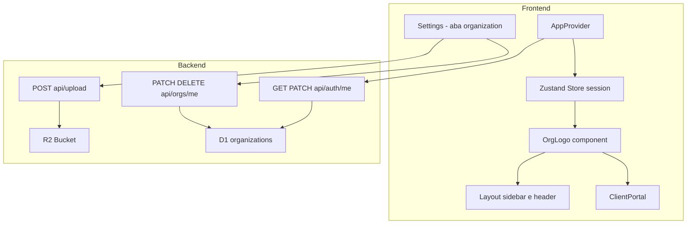
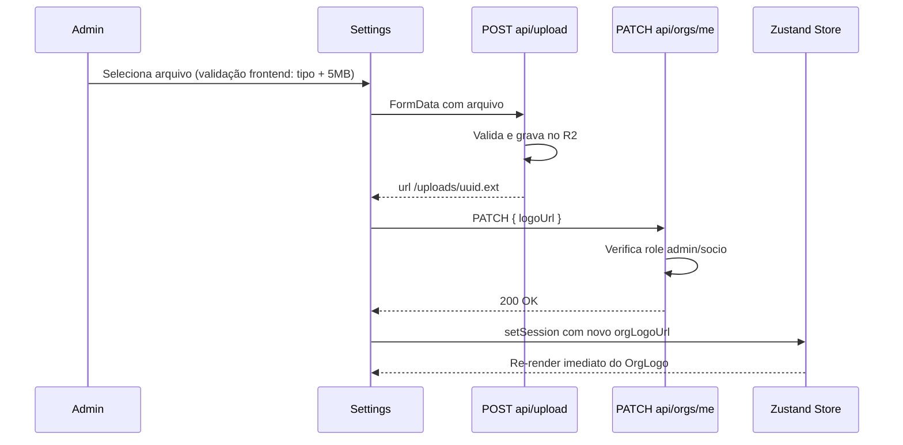
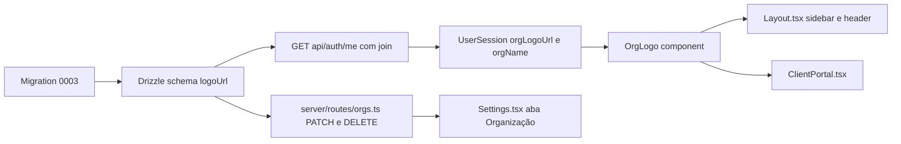

# Design Técnico — White-Label

## Overview

Esta feature permite que cada organização cadastrada no Naka OS faça upload do seu próprio logotipo, que substituirá toda referência visual do Naka OS no painel interno (sidebar e header) e no portal do cliente. O escopo desta fase cobre exclusivamente o logotipo — cores customizadas e domínio próprio ficam para fases futuras.

**Purpose**: Entregar identidade de marca própria para agências que usam o Naka OS como plataforma white-label, eliminando qualquer referência ao Naka OS na experiência dos seus próprios clientes.

**Users**: Administradores e sócios (`admin`, `socio`) gerenciam a logo via Settings. Todos os membros internos e clientes externos a veem aplicada automaticamente.

**Impact**: Adiciona coluna `logo_url` à tabela `organizations`; estende `GET /api/auth/me` com join em `organizations`; cria dois novos endpoints em `server/routes/orgs.ts`; substitui `/naka-logo.svg` por componente `OrgLogo` condicional em `Layout.tsx` e `ClientPortal.tsx`; adiciona aba "Organização" em `Settings.tsx`.

### Goals

- Logo da organização exibida em sidebar, header e portal do cliente
- Upload, substituição e remoção via Settings (admin/socio)
- Fallback textual com iniciais quando sem logo configurada
- Isolamento multi-tenant estrito — logo vinculada ao `org_id` do JWT

### Non-Goals

- Cores customizadas e temas por organização
- Domínio próprio (custom domain)
- Acesso ao logo sem autenticação (endpoint totalmente público/unauthenticated)
- Redimensionamento ou crop automático da imagem no servidor

---

## Architecture

### Existing Architecture Analysis

- `POST /api/upload` (R2): Aceita JPEG, PNG, WebP, SVG, GIF, PDF com limite de 20 MB. Retorna `{ url: '/uploads/{uuid}.{ext}' }`. Reusado sem modificação.
- `GET /api/auth/me`: Consulta apenas a tabela `users`; será estendido com join em `organizations`.
- `PATCH /api/auth/me`: Já existe para `name` e `activeClientId`. Não é alterado por esta feature.
- `Layout.tsx`: Sidebar desktop e header mobile usam `` diretamente — substituídos pelo componente `OrgLogo`.
- `Settings.tsx`: Estrutura de abas com role-guard — nova aba `organization` adicionada ao array `tabs`.
- Migrations aplicadas: `0000_initial_schema.sql`, `0001_multi_tenancy.sql`. Migration desta feature: `0003_org_logo_url.sql` (0002 reservado pela feature task-views).

### Architecture Pattern & Boundary Map



**Key decisions:**
- `OrgLogo` é o único ponto de renderização do logotipo — encapsula a lógica de img + fallback de iniciais
- `GET /api/auth/me` é a única fonte de inicialização do `orgLogoUrl` no store — portal do cliente usa o mesmo fluxo via `AppProvider`, sem endpoint público separado
- Atualização/remoção de logo flui: Settings → `POST /api/upload` (obter URL) → `PATCH /api/orgs/me` (persistir) → store update → re-render imediato em todos os componentes que consomem `session.orgLogoUrl`

### Technology Stack

| Layer | Escolha / Versão | Papel nesta feature | Notas |
|-------|-----------------|---------------------|-------|
| Frontend | React 19 + TypeScript | Componente OrgLogo, aba Settings | — |
| State | Zustand 5 | `session.orgLogoUrl` + `session.orgName` | Sem middleware novo |
| Backend | Hono 4 + Cloudflare Workers | Novos endpoints em `orgs.ts` | Reusa `requireAuth` middleware |
| Database | Cloudflare D1 + Drizzle ORM | `organizations.logo_url` | Migration manual 0003 |
| Storage | Cloudflare R2 | Armazenamento da imagem | Endpoint upload existente |
| UI | shadcn/ui + Tailwind v4 | Botão, skeleton, dialog de confirmação | — |

---

## System Flows

### Upload e Atualização da Logo



### Remoção da Logo

```mermaid
sequenceDiagram
    participant U as Admin
    participant ST as Settings
    participant OR as DELETE api/orgs/me/logo
    participant Store as Zustand Store

    U->>ST: Clica em remover
    ST-->>U: Dialog de confirmação
    U->>ST: Confirma
    ST->>OR: DELETE /api/orgs/me/logo
    OR->>OR: Verifica role admin/socio; seta logo_url = NULL
    OR-->>ST: 200 OK
    ST->>Store: setSession com orgLogoUrl = null
    Store-->>ST: OrgLogo exibe fallback de iniciais
```

---

## Requirements Traceability

| Requisito | Resumo | Componente(s) | Interface | Fluxo |
|-----------|--------|---------------|-----------|-------|
| 1.1 | Upload via POST /api/upload + salvar em organizations | Settings, PATCH /api/orgs/me | `OrgUpdateRequest` | Upload flow |
| 1.2 | Toast + atualização imediata sem reload | Settings, Store | `setSession` | Upload flow |
| 1.3 | Validação de tipo no frontend | Settings | `validateLogoFile` | — |
| 1.4 | Validação de tamanho 5 MB no frontend | Settings | `validateLogoFile` | — |
| 1.5 | Erro de rede: manter logo anterior | Settings | try/catch + toast | — |
| 1.6 | Apenas admin/socio: 403 para outros | PATCH /api/orgs/me | `requireRole` | — |
| 2.1 | Coluna logo_url na tabela organizations | D1 migration 0003 | SQL schema | — |
| 2.2 | URL no formato /uploads/{uuid}.{ext} | POST /api/upload | — | — |
| 2.3 | logo_url exposta em GET /api/auth/me | GET /api/auth/me | `MeResponse` | — |
| 2.4 | Retornar null quando sem logo | GET /api/auth/me | `MeResponse` | — |
| 3.1 | Logo na sidebar (painel interno) | Layout, OrgLogo | `OrgLogoProps` | — |
| 3.2 | Logo no header (painel interno) | Layout, OrgLogo | `OrgLogoProps` | — |
| 3.3 | Fallback de iniciais quando sem logo | OrgLogo | `OrgLogoProps` | — |
| 3.4 | Skeleton durante loading inicial | OrgLogo | `OrgLogoProps` | — |
| 3.5 | Fallback ao falhar carregar imagem | OrgLogo | `onError` handler | — |
| 4.1 | Logo da organização no portal do cliente | ClientPortal, OrgLogo | `session.orgLogoUrl` | — |
| 4.2 | Carregar logo via endpoint autenticado (JWT) | GET /api/auth/me | `MeResponse` | — |
| 4.3 | Fallback de iniciais no portal | OrgLogo | `OrgLogoProps` | — |
| 4.4 | Fallback ao falhar no portal | OrgLogo | `onError` handler | — |
| 5.1 | Dialog de confirmação antes de remover | Settings | `ConfirmDialog` | Remoção flow |
| 5.2 | Remover: logo_url = NULL + atualização imediata | DELETE /api/orgs/me/logo, Store | `setSession` | Remoção flow |
| 5.3 | Apenas admin/socio: 403 para outros | DELETE /api/orgs/me/logo | `requireRole` | — |
| 6.1 | Upload de nova logo substitui a anterior | PATCH /api/orgs/me | `OrgUpdateRequest` | Upload flow |
| 6.2 | Atualização em tempo real (sidebar, header, portal) | Store + OrgLogo | `setSession` | Upload flow |
| 7.1 | Seção na Settings (admin/socio) | Settings | tab `organization` | — |
| 7.2 | Preview da logo atual + controles | Settings | `OrgLogoSection` | — |
| 7.3 | Área de upload quando sem logo | Settings | `OrgLogoSection` | — |
| 7.4 | Atualizar Zustand store após upload/remoção | Settings | `setSession` | Upload/Remoção flow |
| 8.1 | logo_url associada ao org_id do JWT | PATCH/DELETE /api/orgs/me | `requireAuth` | — |
| 8.2 | Validar org_id no JWT em todo endpoint | PATCH/DELETE /api/orgs/me | `requireAuth` | — |
| 8.3 | Cada org vê somente sua logo | GET /api/auth/me com join | `MeResponse` | — |

---

## Components and Interfaces

### Resumo de Componentes

| Componente | Camada | Intenção | Requisitos | Dependências P0 | Contratos |
|------------|--------|----------|------------|-----------------|-----------|
| `OrgLogo` | UI | Exibir logo com fallback de iniciais | 3.1–3.5, 4.1, 4.3, 4.4 | Store session | State |
| `OrgLogoSection` | UI | Seção Settings para gerenciar logo | 7.1–7.4 | POST /api/upload, PATCH/DELETE /api/orgs/me | State |
| `GET /api/auth/me` (estendido) | Backend | Expor orgLogoUrl e orgName no perfil | 2.3, 2.4, 4.2, 8.3 | D1 organizations | API |
| `PATCH /api/orgs/me` | Backend | Persistir nova logo_url na organização | 1.1, 1.6, 6.1, 8.1, 8.2 | D1 organizations | API |
| `DELETE /api/orgs/me/logo` | Backend | Remover logo (logo_url = NULL) | 5.2, 5.3, 8.1, 8.2 | D1 organizations | API |

---

### Frontend — UI Components

#### OrgLogo

| Campo | Detalhe |
|-------|---------|
| Intent | Componente reutilizável que exibe a logo da organização ou, na ausência, as iniciais do nome da org |
| Requirements | 3.1, 3.2, 3.3, 3.4, 3.5, 4.1, 4.3, 4.4 |

**Contracts**: State [ ✓ ]

```typescript
interface OrgLogoProps {
  logoUrl: string | null | undefined;
  orgName: string;
  className?: string;
  size?: 'sm' | 'md' | 'lg';   // sm: h-5, md: h-6 (padrão), lg: h-8
  isLoading?: boolean;          // true → exibe skeleton
}
```

**Implementation Notes**
- Quando `isLoading === true`: exibir `div` com classe `animate-pulse bg-white/10 rounded`
- Quando `logoUrl` é não-nulo: renderizar ` setFailed(true)} />`; se `failed === true`, mostrar fallback de iniciais
- Fallback de iniciais: pegar as primeiras letras de cada palavra do `orgName` (máximo 2), exibir em `div` estilizado
- Usado em: `Layout.tsx` (sidebar + header mobile) e `ClientPortal.tsx`
- _Requirements: 3.3, 3.4, 3.5, 4.3, 4.4_

---

#### OrgLogoSection (Settings — aba Organização)

| Campo | Detalhe |
|-------|---------|
| Intent | Seção dentro da aba "Organização" em Settings para upload, preview e remoção da logo |
| Requirements | 1.1–1.6, 5.1–5.3, 6.1, 6.2, 7.1–7.4 |

**Contracts**: State [ ✓ ]

**Responsibilities & Constraints**
- Validar arquivo antes do upload (tipo: JPEG/PNG/WebP/SVG; tamanho: máximo 5 MB)
- Orquestrar dois passos: `POST /api/upload` (obter URL) → `PATCH /api/orgs/me` (persistir)
- Exibir preview da logo atual quando `session.orgLogoUrl` não é nulo
- Exibir área de seleção de arquivo quando não há logo
- Após upload/remoção bem-sucedidos, chamar `setSession` com novo `orgLogoUrl`

**Dependencies**
- Inbound: `session.orgLogoUrl`, `session.orgName` — dados atuais do store (P0)
- Outbound: `POST /api/upload` — upload para R2 (P0)
- Outbound: `PATCH /api/orgs/me` — persistir logo_url (P0)
- Outbound: `DELETE /api/orgs/me/logo` — remoção (P0)
- Outbound: `setSession` action — sync do store (P0)

##### State Management

```typescript
interface OrgLogoSectionState {
  isUploading: boolean;
  isRemoving: boolean;
  showConfirmDialog: boolean;
}

// Funções de validação (síncronas, client-side)
function validateLogoFile(file: File): { valid: true } | { valid: false; error: string };
// - Verifica file.type ∈ ['image/jpeg','image/png','image/webp','image/svg+xml']
// - Verifica file.size <= 5 * 1024 * 1024
```

**Implementation Notes**
- Integração: exibir aba "Organização" no array de tabs com role guard `session?.role === 'admin' || session?.role === 'socio'`
- Validação: executar `validateLogoFile` antes de qualquer chamada de rede; rejeitar com toast de erro descritivo
- Riscos: se `POST /api/upload` suceder mas `PATCH /api/orgs/me` falhar, a imagem fica orphaned no R2 (aceitável nesta fase — sem limpeza automática)

---

### Backend — API

#### GET /api/auth/me (estendido)

| Campo | Detalhe |
|-------|---------|
| Intent | Incluir `orgLogoUrl` e `orgName` da organização do usuário na resposta de perfil |
| Requirements | 2.3, 2.4, 4.2, 8.3 |

**Contracts**: API [ ✓ ]

##### API Contract

| Method | Endpoint | Request | Response | Errors |
|--------|----------|---------|----------|--------|
| GET | `/api/auth/me` | — (JWT cookie) | `MeResponse` (atualizado) | 401 (sem JWT), 500 |

```typescript
interface MeResponse {
  user: {
    id: string;
    email: string;
    name: string;
    role: 'admin' | 'socio' | 'lider' | 'seeder' | 'cliente';
    activeClientId: string | null;
    orgId: string;
    orgLogoUrl: string | null;   // NOVO — null quando organizations.logo_url IS NULL
    orgName: string;             // NOVO — organizations.name
    taskView?: string;           // De feature task-views
  };
}
```

**Implementation Notes**
- Integração: substituir query `db.select().from(users)` por query com join em `organizations` para obter `logo_url` e `name`
- Validação: se join falhar (org não encontrada), retornar `orgLogoUrl: null`, `orgName: ''` sem erro fatal
- Riscos: pequeno overhead de join em toda chamada de `/me` — aceitável dado que é feita apenas no init do AppProvider

---

#### PATCH /api/orgs/me

| Campo | Detalhe |
|-------|---------|
| Intent | Atualizar o campo `logo_url` da organização do usuário autenticado |
| Requirements | 1.1, 1.6, 6.1, 8.1, 8.2 |

**Contracts**: API [ ✓ ]

##### API Contract

| Method | Endpoint | Request | Response | Errors |
|--------|----------|---------|----------|--------|
| PATCH | `/api/orgs/me` | `{ logoUrl: string }` | `{ ok: true }` | 400 (URL inválida), 401 (sem JWT), 403 (role inválida), 500 |

```typescript
interface OrgUpdateRequest {
  logoUrl: string;   // Deve começar com '/uploads/'
}
```

**Preconditions**: JWT válido; role deve ser `admin` ou `socio`; `logoUrl` deve ser string não-vazia.

**Implementation Notes**
- Extrair `orgId` do JWT via middleware `requireAuth` — nunca do body
- Role check explícito: `if (!['admin','socio'].includes(role)) return c.json({error:'Forbidden'},403)`
- Validação: `logoUrl` deve começar com `/uploads/` para evitar armazenar URLs externas arbitrárias
- Operação: `db.update(organizations).set({ logoUrl }).where(eq(organizations.id, orgId))`

---

#### DELETE /api/orgs/me/logo

| Campo | Detalhe |
|-------|---------|
| Intent | Remover a logo da organização definindo `logo_url = NULL` |
| Requirements | 5.2, 5.3, 8.1, 8.2 |

**Contracts**: API [ ✓ ]

##### API Contract

| Method | Endpoint | Request | Response | Errors |
|--------|----------|---------|----------|--------|
| DELETE | `/api/orgs/me/logo` | — | `{ ok: true }` | 401, 403, 500 |

**Preconditions**: JWT válido; role deve ser `admin` ou `socio`.

**Implementation Notes**
- Mesmo role check de `PATCH /api/orgs/me`
- Operação: `db.update(organizations).set({ logoUrl: null }).where(eq(organizations.id, orgId))`

---

## Data Models

### Domain Model

A feature não introduz novos agregados. O campo `logo_url` é um atributo de identidade visual do agregado `Organization`. O campo `orgLogoUrl` em `UserSession` é um cache de leitura derivado do agregado.

### Logical Data Model

**Alterações na entidade `Organization`:**
- Novo campo: `logoUrl: string | null` — URL relativa da logo no R2; `null` indica sem logo configurada

**Alterações na interface `UserSession` (store):**
- `orgLogoUrl?: string | null` — cache do `organizations.logo_url` para uso nos componentes
- `orgName?: string` — cache do `organizations.name` para o fallback de iniciais

### Physical Data Model

**Migration `0003_org_logo_url.sql`:**

```sql
ALTER TABLE organizations ADD COLUMN logo_url TEXT;
```

**Drizzle schema (`server/db.ts`)** — campo a adicionar na tabela `organizations`:

```typescript
logoUrl: text('logo_url'),
```

### Data Contracts & Integration

**`GET /api/auth/me` — campos adicionados na resposta:**

```typescript
{
  orgLogoUrl: string | null;   // organizations.logo_url
  orgName: string;             // organizations.name
}
```

**`PATCH /api/orgs/me` — request body:**

```typescript
{
  logoUrl: string;   // Formato: '/uploads/{uuid}.{ext}'
}
```

---

## Error Handling

### Error Strategy

Operações de logo usam o padrão toast/feedback visual sem reverter o estado do formulário em casos de falha de rede. A imagem permanece no R2 mesmo se o PATCH falhar (aceitável nesta fase).

### Error Categories and Responses

**Erros de validação frontend (pré-upload):**
- Tipo inválido: `toast.error('Formato não suportado. Use JPEG, PNG, WebP ou SVG.')`
- Tamanho excedido: `toast.error('Arquivo maior que 5 MB.')`

**Erros de rede / servidor:**
- Upload falha: `toast.error('Falha ao enviar arquivo. Tente novamente.')` — logo anterior mantida
- PATCH falha: `toast.error('Falha ao salvar logo.')` — store não atualizado
- DELETE falha: `toast.error('Falha ao remover logo.')` — logo anterior mantida

**Erro de carregamento da imagem (browser):**
- `onError` no `` → `OrgLogo` comuta para fallback de iniciais silenciosamente (Requirement 3.5, 4.4)

### Monitoring

Erros de endpoints são capturados pelo Hono com `console.error`. Falhas de carregamento de imagem não geram log (silenciosas por design).

---

## Testing Strategy

### Unit Tests

- `validateLogoFile`: tipo inválido, tamanho exato de 5 MB, tamanho acima, tipo e tamanho válidos
- `OrgLogo`: renderiza img quando `logoUrl` não-nulo, renderiza iniciais quando `logoUrl` nulo, renderiza fallback em `onError`, renderiza skeleton quando `isLoading`

### Integration Tests

- `GET /api/auth/me` retorna `orgLogoUrl` e `orgName` após join com `organizations`
- `PATCH /api/orgs/me` persiste `logo_url` no D1 para admin; retorna 403 para `lider`
- `DELETE /api/orgs/me/logo` seta `logo_url = NULL` no D1; retorna 403 para `seeder`
- Multi-tenant: usuário de org A não consegue ler/escrever logo de org B

### E2E/UI Tests

- Admin faz upload → logo aparece imediatamente em sidebar e header
- Admin remove logo → fallback de iniciais aparece imediatamente
- Cliente acessa portal → logo da agência exibida; sem logo → iniciais da agência

---

## Security Considerations

- `orgId` é sempre extraído do JWT pelo `requireAuth` middleware — nunca aceito do request body
- `PATCH /api/orgs/me`: validação que `logoUrl` começa com `/uploads/` evita injeção de URLs externas arbitrárias
- Role check explícito antes de qualquer write operation (403 para roles não autorizadas)
- Isolamento multi-tenant garantido pelo `where(eq(organizations.id, orgId))` usando o `orgId` do JWT

---

## Migration Strategy



1. **Fase 1 — Backend**: Executar migration + atualizar schema Drizzle + estender `GET /api/auth/me` + criar `server/routes/orgs.ts`
2. **Fase 2 — Store**: Adicionar `orgLogoUrl` e `orgName` a `UserSession`; atualizar `AppProvider` para extrair esses campos
3. **Fase 3 — UI**: Criar `OrgLogo` + atualizar `Layout.tsx` e `ClientPortal.tsx` + adicionar aba em `Settings.tsx`

**Rollback**: `ALTER TABLE organizations DROP COLUMN logo_url` não é suportado em D1. Rollback via deploy de versão anterior do código (coluna ignorada pelos handlers anteriores).
